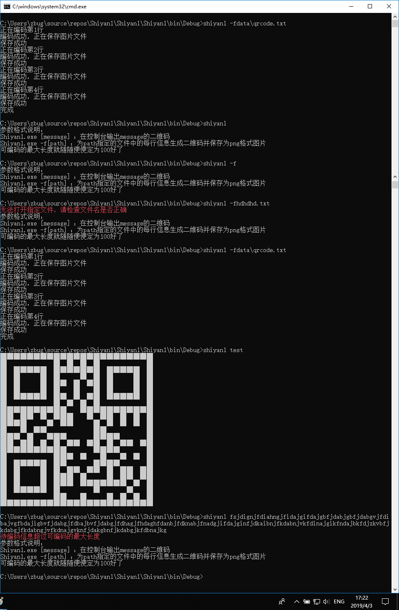
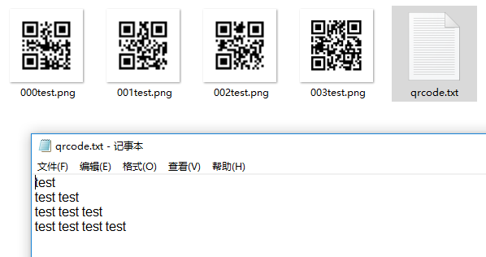
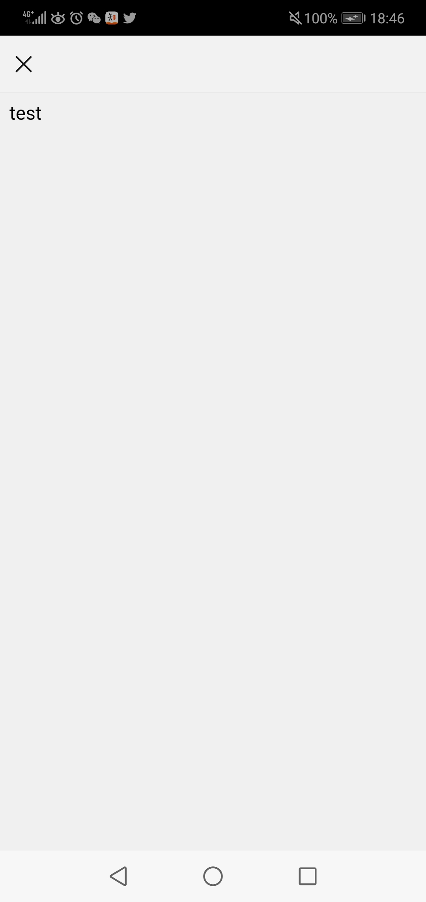

# 实验一：C#控制台编程
## 功能概述
- 从控制台参数获得待编码信息并将生成的二维码输出到控制台
- 从控制台参数获得文件路径，为文件的每行信息生成一个二维码，并保存为png格式的图片
## 项目特色
- 参数格式：
   - Shiyan1.exe [message] ：在控制台输出message的二维码
   - Shiyan1.exe -f[path] ：为path指定的文件中的每行信息生成二维码并保存为png格式图片
   - 可编码的最大长度为100
- 在没有输入参数或输入了非法参数时，程序会报错并输出帮助信息，提示正确的参数格式
- 程序中实现的编码函数`static QrCode EnCode(char level, String content)`可以通过第一个参数设置纠错等级，但并没有对用户提供使用此功能的方法，程序中设定的纠错等级为M
## 代码总量 127行
## 工作时间 共计约4小时
## 结论
### 实验过程
- 安装并学习使用QrCode.Net库
- 对于控制台输出，根据编码得到的QrCode对象的matrix，用“█”和“　”组成表达二维码的字符串输出
- 对于文件输出，先用File.ReadAllLines()取得各行信息，对每行信息进行编码后，用GraphicsRenderer类对象的WriteToStream方法以png格式写入输出文件流
### 实验结果
控制台运行结果

生成二维码图片

扫描控制台中二维码结果

